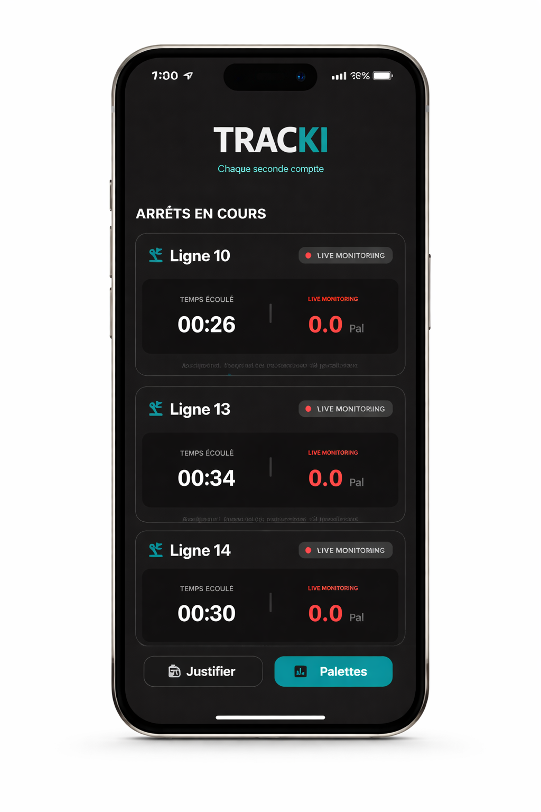
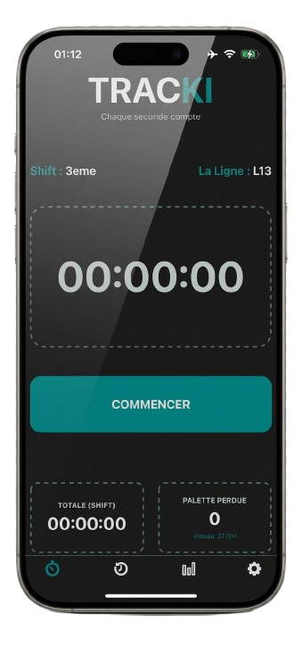
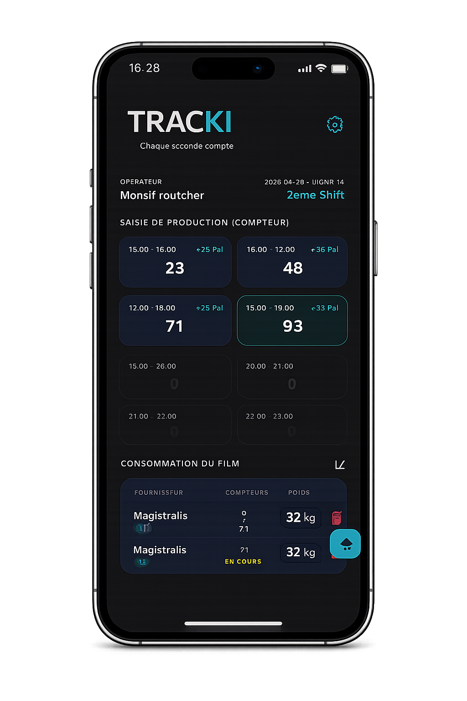

<h1 align="center">Hi 👋, I'm Routcher Monsif</h1>
<h3 align="center">Full-Stack Developer from Morocco 🇲🇦</h3>

🚀 I build real-world systems that connect people, data, and operations

---

### 👨‍💻 About Me

- 🔭 Currently building **TRACKI ECOSYSTEM**
- 🧠 Full-Stack Developer (Mobile + Backend + Systems)
- 💬 Ask me about: **React Native, React, C#, SQL, Firebase**
- 📫 Reach me at: **amyroutcher@gmail.com**

---

### 📱 TRACKI ECOSYSTEM

> A mobile application designed to **connect factory operations into one smart system**

- 📊 Collects real-time data from **operators**
- 👨‍🏭 Validates and manages workflow via **chef d’équipe**
- 🚚 Connects production with **logistics**
- 🔗 Creates a **complete data flow** from production → management → delivery

💡 Goal: Replace manual processes with a **connected, efficient, and reliable system**

---

---

---

### 📸 App Preview (TRACKI)

<table align="center">
<tr>

<td align="center">
 
<strong>Logistics</strong>
</td>

<td align="center">
 
<strong>Production (ACE)</strong>
</td>

<td align="center">
 
<strong>Operator (Pal)</strong>
</td>

</tr>
</table>

---

### 🌐 Connect with Me

---

### 🛠️ Languages & Tools

---

### ⚡ Mindset

> I don’t just build apps — I build systems that solve real problems.

---
